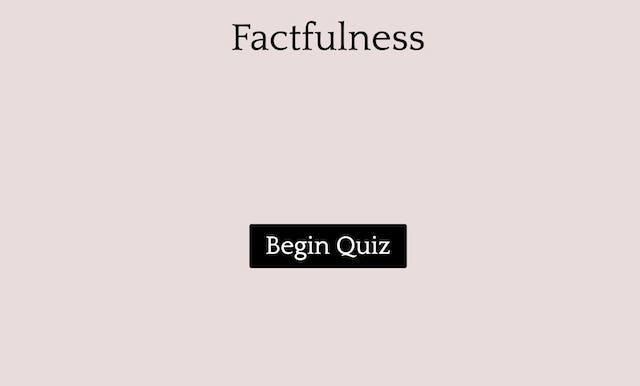
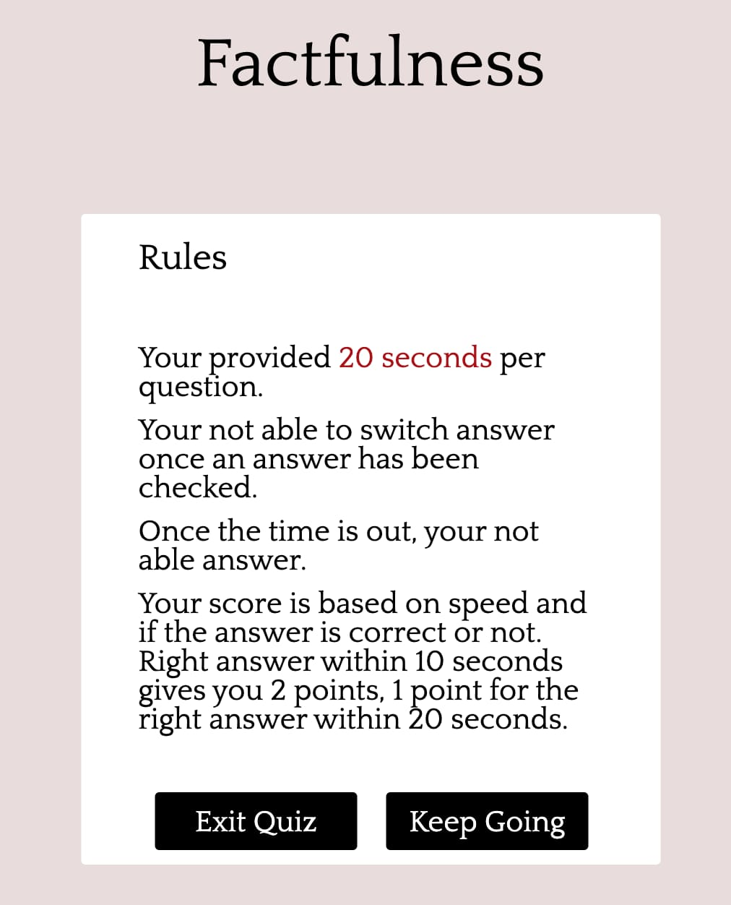
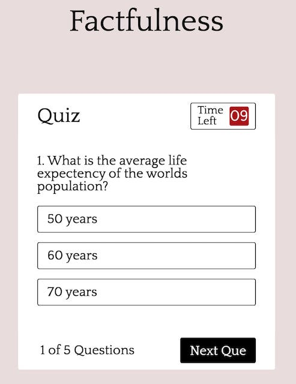
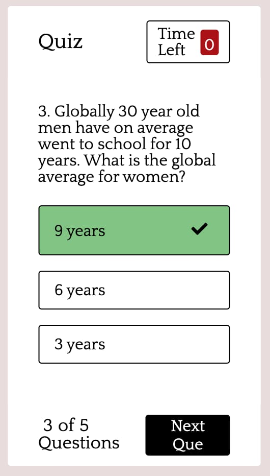
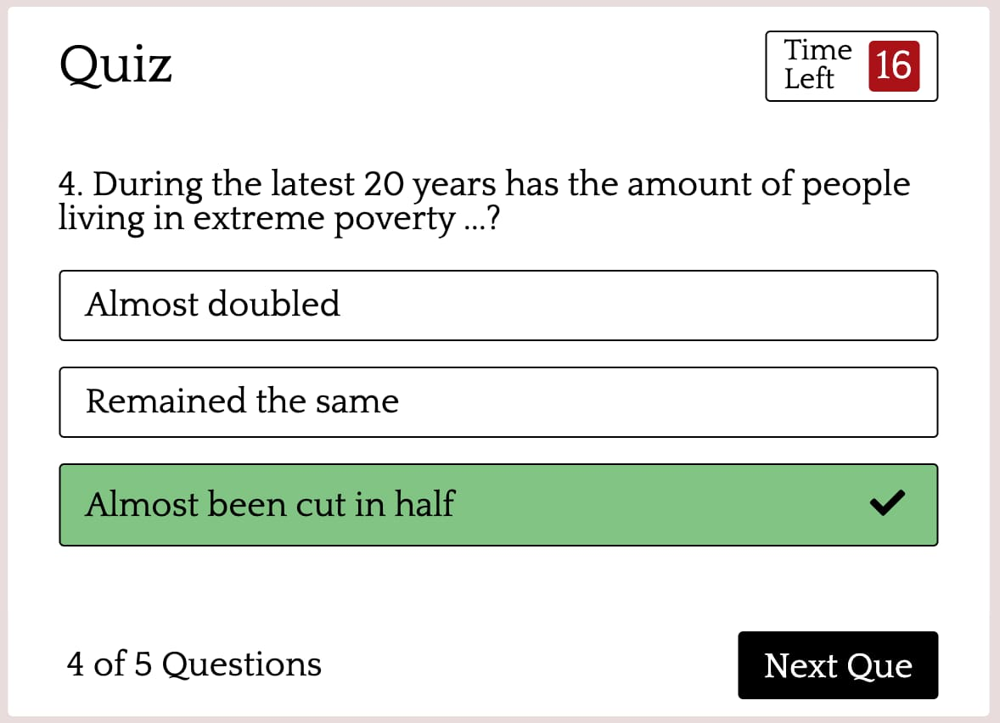
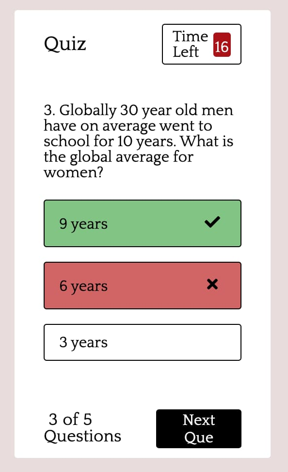
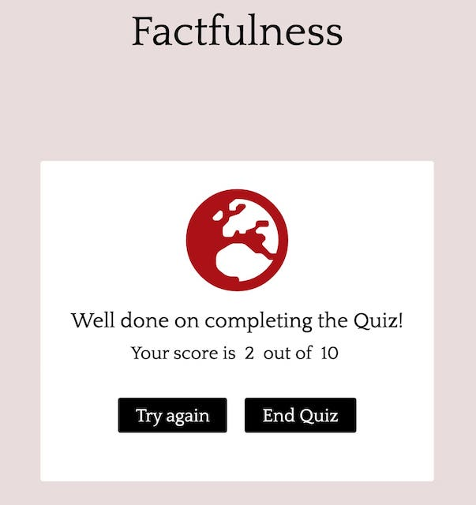

# Quiz Factfullness

The quiz factfulness quiz is based up on the information in the book factfullness by Hans Rosling, Anna Rosling Rönnlund and Ola Rosling. The book is in part a guide which covers the world and missconceptions about the world.
The quiz is for anyone curious about the worlds prerequisites and our often in acqurate world views. 

## index.html

## Wire frames

# Existing Features
The site only has one page, the different parts of the quiz are stacked on top of each other with z-index.

## 

## 

## First page

The first page is the beginning of the quiz, you access the quiz through clicking the begin quiz button.

## Rules page

The second part is the rules part. You provided the rules for the quiz as well as being able to start the quiz or exiting the quiz. If one clicks the exit quiz button one is transfered to the first page.

## quiz pages

The quiz is comprised of 5 questions with 3 answers for each. The next question appers after Next Que (Question) has been clicked. How many questions their are and how many you have answered is shown in the left corner. 

### Timer

Each question one is allowed 20 seconds to answer. If the answer is made within the first 10 seconds you will get 2 points for the right answer.
If the timer goes out before an answer has been chosen one will be shown the correct answer.

### Answers

If one chooses the right answer the answer bar will turn green. A icon with a check mark icon will also apper in black, black was choosen so color blind people can recognize if the answer was right.
If one chooses the wrong answer the answer bar will turn red. A icon with a cross will appear in black. The green bar and checkmark will also appear to show the right answer.

 

## Quiz finished page

This page shows the score. If you press the try again button you will get redirected to the first quiz question. The previous score is deleted when has pressed try again. 
The end quiz button transfers one to the first page.

 # Testing

 ## HTML

 ### index.html 

 

## CSS

* A semicolon was forgotten, now added

### JavaScript

### Device testing

* Tested on Google Chrome, Firefox and Safari without issues

## Unfixed Bugs

# Deployment

1. In the repository hompage on github select settings
2. In the options field on the left  select pages
3. In the source branch field, select master (none is default)
4. Optional to choose a theme (none was chosen)
5. Make sure the Enforce HTTPS box is checked
6. Click save to publish

 Here is a link to the finished website [Quiz Factfullness](https://carlssonoscar.github.io/quiz-factfullness/)

# Credits

The code for the quiz and timer was acquired through parts of a tutorial on [Youtube](https://www.youtube.com/watch?v=pQr4O1OITJo&t=254s), [Youtube](https://www.youtube.com/watch?v=WUBhpSRS_fk&t=0s). The tutorials code acted as a point of departure, the site was redesigned, certain parts of the code was eliminated, and the quiz was made responsive.     

# Content

Content was gathered from the book Factfulness [Gapminder]https://www.gapminder.org/factfulness-book/.

# Media

[Font Awesome](https://fontawesome.com/) was used for the icons through out the site.

# Tools

 [Balsamiq](https://balsamiq.com/) was used to make the wireframes.

# Acknowledgements 

[Code Institute](https://codeinstitute.net) for providing excellent course material.

[W3 Schools](https://w3school.com) has been an aditional valuable source for learning how to code.